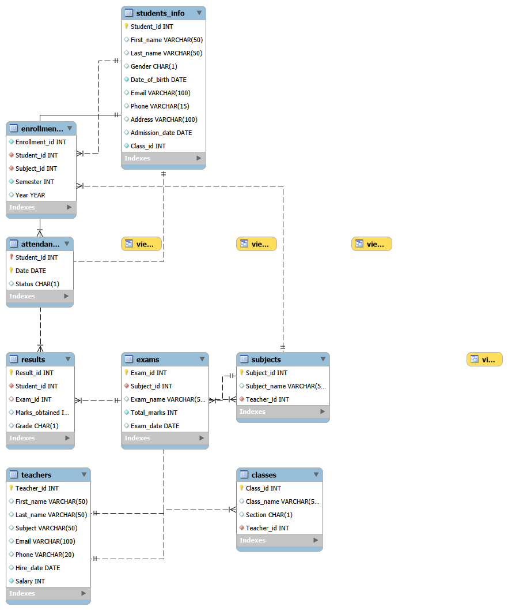

# Smart School Management System (SQL Database Project)

## Project Overview

The **Smart School Management System** is a relational database project developed using **MySQL**. It simulates the core operations of a school by managing students, teachers, classes, subjects, enrollments, attendance, examinations, and results.

The project demonstrates the practical use of **SQL** for database design, data management, and querying while following relational database principles such as **Primary Keys**, **Foreign Keys**, and table relationships.

This project was built as a comprehensive SQL practice project covering database creation, schema design, data insertion, querying, joins, subqueries, views, indexes, and schema modifications.

---

# Technologies Used

- MySQL 8.x
- MySQL Workbench
- SQL (DDL, DML, DQL)

---

# Project Structure

```
Smart_School_DB/
│
├── schema.sql          # Database schema and table creation
├── insert_data.sql     # Sample data for all tables
├── queries.sql         # SQL practice queries
├── ER_Diagram.png      # Entity Relationship Diagram
└── README.md
```

---

# 🗄 Database Schema

The database contains the following tables:

- Teachers
- Classes
- Students
- Subjects
- Enrollments
- Attendance
- Exams
- Results

Each table is connected using appropriate **Primary Keys** and **Foreign Keys** to maintain referential integrity.

---

# Entity Relationships

The database follows a relational model.

```
Teachers
   │
   ├──────────────┐
   │              │
Classes       Subjects
   │              │
   │              │
Students     Enrollments
   │              │
   ├──────┐       │
   │      │       │
Attendance Results │
              │    │
              Exams
```
 
## Entity Relationship Diagram
> `ER_Diagram.png`


```markdown
## Entity Relationship Diagram

---

# Database Features

The project demonstrates:

- Relational Database Design
- Primary Keys
- Foreign Keys
- One-to-Many Relationships
- Many-to-Many Relationships (using junction table)
- Referential Integrity

---

# SQL Concepts Covered

## Database Operations

- CREATE DATABASE
- USE
- SHOW DATABASES
- SHOW TABLES

---

## Table Operations

- CREATE TABLE
- ALTER TABLE
- MODIFY COLUMN
- ADD COLUMN
- DROP COLUMN
- RENAME TABLE

---

## Data Manipulation (DML)

- INSERT
- UPDATE
- DELETE

---

## Data Retrieval (DQL)

- SELECT
- WHERE
- DISTINCT
- ORDER BY
- LIMIT
- BETWEEN
- LIKE
- IS NULL

---

## Aggregate Functions

- COUNT()
- SUM()
- AVG()
- MAX()
- MIN()

---

## Grouping

- GROUP BY
- HAVING

---

## Joins

- INNER JOIN
- LEFT JOIN

---

## Subqueries

Examples include:

- Student with highest marks
- Teacher with highest salary
- Students scoring above average
- Teachers earning above average salary

---

## SQL Functions

### String Functions

- UPPER()
- LOWER()
- CONCAT()
- LENGTH()
- LEFT()
- RIGHT()

### Date Functions

- CURDATE()
- YEAR()
- MONTH()
- DAY()
- DATEDIFF()

---

## Views

The project includes custom SQL Views to simplify frequently used queries.

---

## Indexes

Created and removed indexes to demonstrate query optimization.

---

## Constraint Testing

The project also includes examples of testing database constraints such as:

- Duplicate Primary Keys
- NULL Primary Key
- Invalid Foreign Keys
- Referential Integrity

---

# Sample Queries

Examples include:

- Students belonging to a particular class
- Teachers with salary above a threshold
- Students admitted between dates
- Subject-wise teacher information
- Student examination results
- Student-Class relationships
- Teacher-Class relationships
- Student-Subject relationships
- Aggregate reports
- Highest marks
- Above-average marks
- Salary analysis

---

# Learning Objectives

This project was created to practice and understand:

- Database normalization
- Relational database design
- SQL syntax
- Table relationships
- Query writing
- Data integrity
- Joins and subqueries
- Database optimization using indexes
- Views
- Schema modification

---

# Skills Demonstrated

- Relational Database Design
- SQL Query Writing
- Database Normalization
- Data Modeling
- MySQL Workbench
- CRUD Operations
- Aggregate Analysis
- Joins
- Subqueries
- Views
- Indexes
- Constraint Management

---

#  How to Run

1. Clone this repository.

```
git clone https://github.com/your-username/Smart_School_DB.git
```

2. Open MySQL Workbench.

3. Execute:

- `schema.sql`
- `insert_data.sql`
- `queries.sql`

4. Explore and modify the database.


# Author

Developed by MAHAM KHAN as a hands-on SQL database project for learning relational database design and advanced SQL concepts.


# Acknowledgements

This project was created as a learning project to strengthen practical SQL and relational database management skills through extensive hands-on implementation.